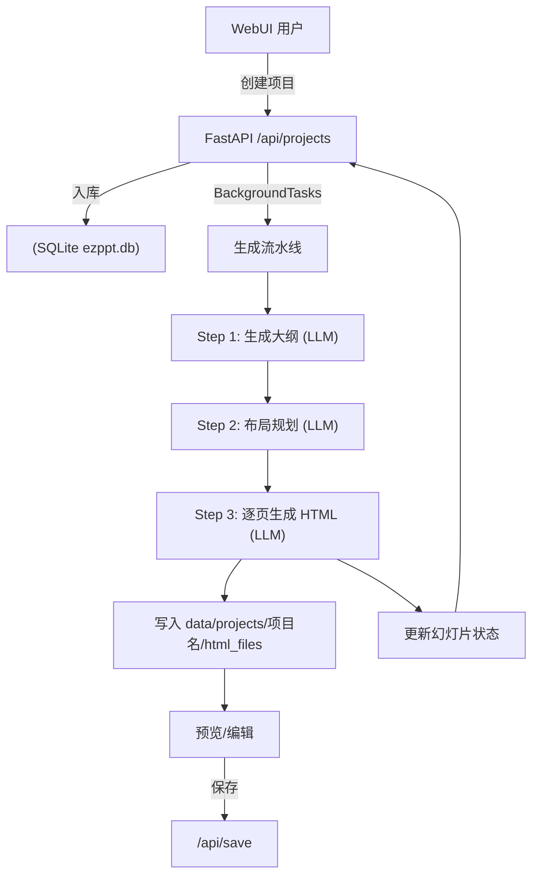
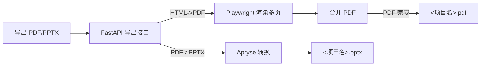

# EZPPT —— 一键生成可导出 PDF/PPTX 的演示文稿平台

EZPPT 是一个基于 FastAPI + Web 前端的本地化演示文稿生成平台：
- 通过大模型自动生成演示大纲与每页 HTML 幻灯片；
- 支持按章节并发生成、风格与布局连贯性控制；
- 可在浏览器中实时预览与编辑，并一键导出为 PDF 或 PPTX；
- 使用 SQLite 本地持久化项目数据与生成进度。

适用于快速搭建主题演讲、技术分享、项目汇报等内容的初稿与成稿。


## 功能与亮点
- 大模型生成
  - 大纲生成：根据主题、受众、风格与参考资料，生成章节与要点。
  - 布局规划：为核心内容页生成“布局指令”，保持页面多样性与统一性。
- 连贯性与风格
  - 第一章作为“风格源”，后续章节可参考以保持全局视觉一致。
  - 同一章节内可参考前序页，增强节奏与连贯性。
- 图片能力（可选）
  - 通过 SearXNG 聚合搜索图片；
- 导出能力
  - PDF：Playwright 渲染 HTML 为 PDF
  - PPTX：基于 Apryse SDK 将 PDF 转换为 PPTX
- 交互友好
  - WebUI 项目面板：创建/删除/重建项目，一键导出与下载；
  - 预览页：侧栏目录 + 页面缓存 + 在线编辑 + 一键保存；
  - 配置页：在线调整 LLM、并发、搜索引擎等运行参数，立即生效。
- 可配置与可控
  - .env + 在线配置；
  - 按章节并发，第一章顺序生成，其余章节可并发（可限流）；
  - 关键环节均有状态与进度可视化。


## 环境要求
- Python 3
- 可访问的 LLM API（OpenAI/Gemini 规范接口）
- 可用的 SearXNG 实例（公共或自建，用于图片搜索，可选）

## 平台支持
- Linux x64
- Linux ARM64
- Windows x64
- macOS（未测试，理论可行）


## 快速开始（本机运行）
1) 准备配置
- 复制根目录 `.env.template` 为 `.env`，根据需要填写：
  - `OUTLINE_*`：大纲模型配置（API_TYPE/API_KEY/API_URL/MODEL）
  - `PPT_*`：页面生成模型配置（留空则回退到 OUTLINE_*）
  - `PIC_*`：图片理解模型配置（需支持多模态，启用图片搜索需要，可选）
  - `SEARXNG_URL`：SearXNG 搜索地址（用于图片搜索，可选）
  - `APRYSE_LICENSE_KEY`：Apryse License Key（导出 PPTX 用，已内置）

1) 安装依赖（任选其一）
- 使用 uv（推荐）：
  ```bash
  uv venv
  uv sync
  # 首次准备依赖（浏览器与 Apryse 资源）
  uv run setup.py
  ```
- 使用 pip：
  ```bash
  python -m venv .venv && source .venv/bin/activate  # Windows 用 .venv\Scripts\activate
  pip install --upgrade pip
  # apryse-sdk 需要额外源
  pip install --extra-index-url https://pypi.apryse.com apryse-sdk
  pip install fastapi uvicorn sqlmodel requests pillow playwright pypdf lxml bs4 python-dotenv
  # 安装浏览器内核（仅一次）
  python -m playwright install chromium-headless-shell --with-deps
  ```

1) 启动服务
```bash
uv run main.py           # 如使用 uv
# 或
python main.py           # 如使用 pip
```

1) 打开浏览器
- 控制台主页：`http://127.0.0.1:8000`

## Docker 运行

### 使用预构建镜像（推荐）
已提供打包好的镜像：`cat3399/ezppt`

```bash
docker pull cat3399/ezppt:latest

# 映射端口与数据目录，并加载 .env 配置
docker run --name ezppt \
  -p 8000:8000 \
  -v "$(pwd)/data:/work/data" \
  --env-file .env \
  cat3399/ezppt:latest
```

- 如不挂载 `data` 目录，容器内数据为临时数据，停止/删除容器会丢失。
- 预构建镜像已在构建阶段完成依赖安装与初始化，如需下载浏览器资源，首次运行可能稍有等待。

### 从源码构建镜像
```bash
docker build -t ezppt .
# 映射端口与数据目录，挂载项目输出
docker run --name ezppt \
  -p 8000:8000 \
  -v "$(pwd)/data:/work/data" \
  --env-file .env \
  ezppt
```
- 构建镜像时会执行：
  - 依赖安装（uv）
  - `uv run setup.py`（安装 Playwright Chromium 与 Apryse 资源，初始化数据库）


## 使用指南（WebUI）
- 新建项目：在首页“新建项目”，输入主题、受众、风格、页数，可选“启用图片搜索”和参考资料；
- 查看进度：右侧项目详情可见百分比，详情页显示分布统计；
- 预览编辑：点击“打开预览”，支持侧栏切页、内容缓存、在线编辑与保存；
- 导出：
  - 项目完成后，可在“更多操作”中选择“导出为 PDF/PPTX”；
  - 导出完成后“下载 PDF/PPTX”按钮自动可用；
- 重新生成：支持“重新生成项目”或“单页重生成”。

生成的文件位于：`data/projects/<项目名>/`
- `html_files/`：逐页 HTML
- `<项目名>.pdf`：合并后的 PDF（导出后生成）
- `<项目名>.pptx`：PPTX 文件（导出后生成）

## 工作流（Workflow）
### 生成流水线


### 导出流程



## 目录结构速览
- `main.py`：FastAPI 入口，挂载 API 与静态 WebUI。
- `src/api/projects.py`：REST API（项目、文件、配置、导出等）。
- `src/agents/`：生成流水线（大纲、布局、HTML、图片）。
- `src/services/`：LLM 适配（OpenAI/Gemini）、图片搜索、常用工具。
- `src/repository/`：SQLModel + SQLite 数据持久化与事务管理。
- `src/html_convert_office/`：HTML→PDF（Playwright）与 PDF→PPTX（Apryse）。
- `webui/`：前端页面与样式（首页、预览、配置）。
- `config/`：运行配置与日志。
- `data/`：运行时数据（`ezppt.db`、`projects/` 项目产物）。


## TODO
- 模板/主题机制（将风格抽象为可复用的主题包）。
- 因HTML->PDF->PPTX流程的原因,无法保留html中的高级特效,目前的提示词对于外观有着严格的限制,后续将会提供仅生成pdf的提示词版本,支持更多的风格

