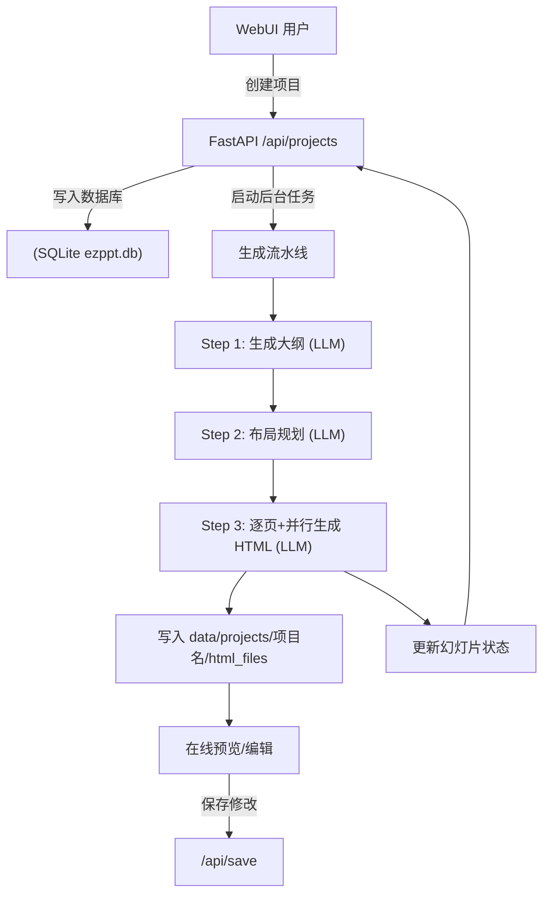
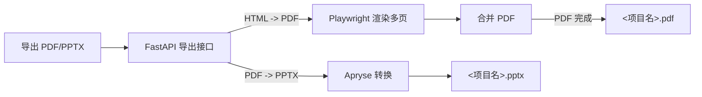
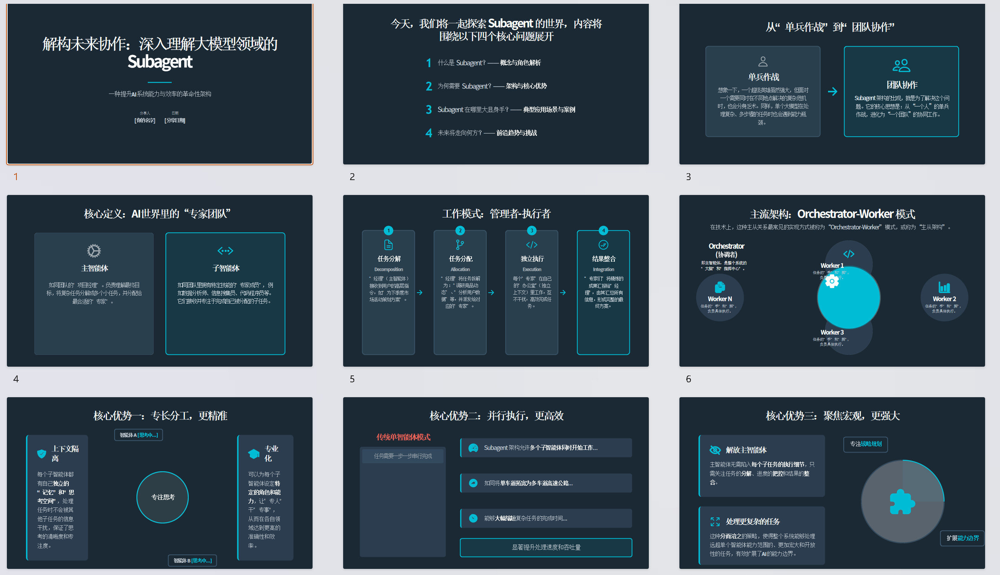
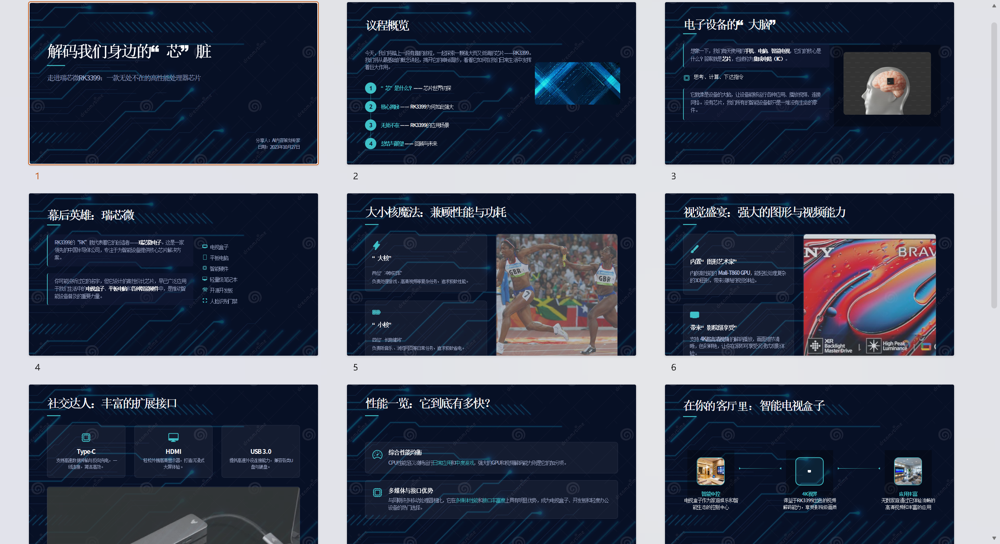

# EZPPT —— 一键生成可导出 PDF/PPTX 的演示文稿平台

> EZPPT 是一个基于 FastAPI + Web 前端的本地化演示文稿生成平台，适用于快速搭建主题演讲、技术分享、项目汇报等内容的初稿。

---

## 🚀 功能与亮点

-   **大模型生成**
    -   **大纲生成**：根据主题、受众、风格与参考资料，生成章节与要点。
    -   **布局规划**：为核心内容页生成“布局指令”，保持页面多样性与统一性。
    -   **页面生成**：调用大模型生成HTML代码。
-   **图片能力（可选）**  通过 SearXNG 聚合搜索图片。
-   **自定义参考资料**：支持自定义参考资料，用于生成内容，减少模型自身知识的幻觉。
-   **在线预览编辑**  可在浏览器中实时预览与编辑。
-   **导出 PDF 或 PPTX**  导出的 PPTX 文件可保持 HTML 预览 90% 的效果，并且内容可二次编辑。

---

## 🛠️ 环境要求

-   Python 3
-   可访问的 LLM API（支持 OpenAI/Gemini 规范接口）
-   可用的 SearXNG 实例（公共或自建，用于图片搜索，可选）

---

## 💻 平台支持

-   Linux (x64 / ARM64)
-   Windows (x64)
-   macOS（未经测试，理论可行）

---

## ✨ 快速开始（本机运行）

### 1. 准备配置

复制根目录下的 `.env.template` 文件为 `.env`，并根据您的环境填写配置：

-   `OUTLINE_*`：大纲生成模型的配置（`API_TYPE` / `API_KEY` / `API_URL` / `MODEL`）
-   `PPT_*`：页面生成模型的配置（若留空，则使用 `OUTLINE_*` 的配置）
-   `PIC_*`：图片理解模型的配置（需支持多模态，启用图片搜索时需要，可选）
-   `SEARXNG_URL`：SearXNG 搜索实例地址（用于图片搜索，可选）
-   `APRYSE_LICENSE_KEY`：Apryse License Key（用于导出 PPTX，已内置）

```bash
cp .env.template .env
```

### 2. 安装依赖（任选其一）

**- 方式一：使用 uv (推荐)**

```bash
# 创建并激活虚拟环境
uv venv

# 同步安装依赖
uv sync

# 首次运行时，准备浏览器与 Apryse 资源
uv run setup.py
```

**- 方式二：使用 pip**

```bash
# 创建并激活虚拟环境
python -m venv .venv && source .venv/bin/activate  # Windows 用户请使用: .venv\Scripts\activate

# 安装 apryse-sdk (需要额外源)
pip install --extra-index-url https://pypi.apryse.com apryse-sdk

# 安装其他依赖
pip install fastapi uvicorn sqlmodel requests pillow playwright pypdf lxml bs4 python-dotenv

# 安装额外依赖
python setup.py
```

### 3. 启动服务

```bash
# 如果使用 uv
uv run main.py

# 如果使用 pip
python main.py
```

### 4. 打开浏览器

访问控制台主页：`http://127.0.0.1:8000`

---

## 🐳 Docker 运行

### 使用预构建镜像（推荐）

我们已提供打包好的 Docker 镜像：`cat3399/ezppt`

```bash
docker run --name ezppt \
  -p 8000:8000 \
  -v "$(pwd)/data:/work/data" \
  -v "$(pwd)/.env:/work/.env" \
  cat3399/ezppt:latest
```

### 从源码构建镜像

1.  **构建镜像**
    
    ```bash
    docker build -t ezppt .
    ```
    
2.  **运行容器**
    
    ```bash
    docker run --name ezppt \
      -p 8000:8000 \
      -v "$(pwd)/data:/work/data" \
      -v "$(pwd)/.env:/work/.env" \
      ezppt
    ```

---

## 📖 使用指南 (WebUI)

-   **新建项目**：在首页点击“新建项目”，输入主题、受众、风格、页数，可选“启用图片搜索”和参考资料。
-   **查看进度**：右侧项目详情卡片会显示生成进度百分比，点击进入详情页可查看各部分统计。
-   **预览编辑**：点击项目卡片上的“打开预览”，支持侧边栏切换页面、内容实时编辑与自动保存。
-   **导出文件**：
    -   项目生成完成后，在“更多操作”菜单中选择“导出为 PDF/PPTX”。
    -   导出任务完成后，“下载 PDF/PPTX”按钮将自动变为可用状态。
-   **重新生成**：支持对整个项目或单个页面进行重新生成。

> **文件存储**：
> 生成的文件位于 `data/projects/<项目名>/` 目录下：
> -   `html_files/`：存放每一页的 HTML 文件。
> -   `<项目名>.pdf`：导出后生成的合并 PDF 文件。
> -   `<项目名>.pptx`：导出后生成的 PPTX 文件。

---

## ⚙️ 工作流 (Workflow)

### 生成流水线



### 导出流程



## 效果展示






---

## 📁 目录结构速览

-   `main.py`：FastAPI 应用入口，挂载 API 路由与静态 WebUI。
-   `src/api/projects.py`：核心 REST API（项目、文件、配置、导出等）。
-   `src/agents/`：生成流水线模块（大纲、布局、HTML、图片）。
-   `src/services/`：外部服务适配（LLM、图片搜索）与通用工具。
-   `src/repository/`：数据持久化层（SQLModel + SQLite）。
-   `src/html_convert_office/`：文件转换模块，HTML→PDF (Playwright) 与 PDF→PPTX (Apryse)。
-   `webui/`：前端静态页面与资源（HTML, CSS, JavaScript）。
-   `config/`：运行配置与日志配置。
-   `data/`：运行时数据目录，包含数据库 `ezppt.db` 和所有项目产物 `projects/`。

---

## 📝 TODO

-   [ ] **模板/主题机制**：将风格抽象为可复用的主题包。
-   [ ] **优化导出效果**：由于 `HTML -> PDF -> PPTX` 的转换流程会丢失部分高级特效，目前的提示词对外观有严格限制。后续将提供仅生成 PDF 的提示词版本，以支持更丰富的视觉风格。
-   [ ] **AI 修正**：增加大模型对生成的 HTML 效果进行自动修正与优化。
-   [ ] **联网搜索**：集成联网搜索能力，实现一站式生成包含最新信息的演示文稿。